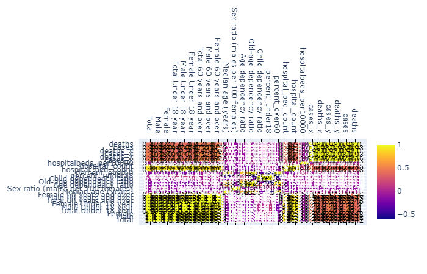

# US-Counties-Vulnerable-to-Covid-19

## Background

The Covid-19 catastrophe has been rapidly developing with no signs of stopping and is currently claiming many lives across the United States and putting many others in danger. Hospitals are currently overwhelmed and are often running out of supplies and capacity. This project aims to explore which US counties are the most vulnerable to the crisis using various population characteristics and hospital beds as criteria for judgement. 

### Correlation heat map

## Conclusion

According to this study, 
