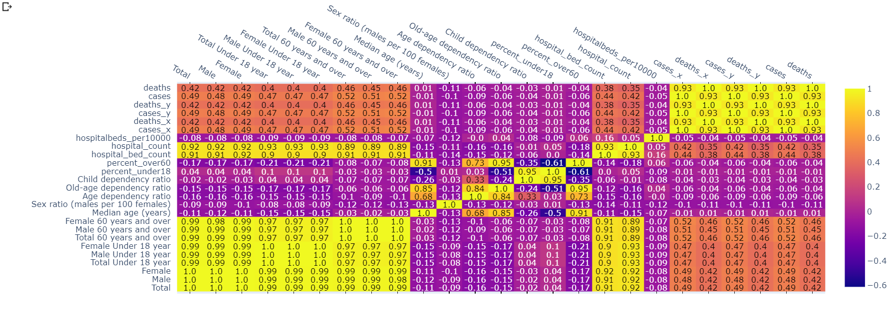

# US-Counties-Vulnerable-to-Covid-19

## Background

The Covid-19 catastrophe has been rapidly developing with no signs of stopping and is currently claiming many lives across the United States and putting many others in danger. Hospitals are currently overwhelmed and are often running out of supplies and capacity. This project aims to explore which US counties are the most vulnerable to the crisis using various population characteristics and hospital beds as criteria for judgement. This analysis was conducted using Google Colab.

### Correlation heat map

## Conclusion

Using this study, we can determine which counties are at risk. Using the bubble map plotting at-risk populations (<18 and 60+) and low hospital beds, we can identify outliers in the graph and decide what to do for them. Additionally, using the heatmap, we can notice trends between Covid-19 and various factors. For instance, we see that the increase comes with increased correlation with cases.

However, we must also note that some factors not included in the study also affect people's wellbeing and the development of the crisis, such as population density and whether people are practicing good hygiene and social distancing protocols. We also note that this is a developing situation with different states at different stages of the curve so whatever actions taken to aid states and counties must take that into account.
